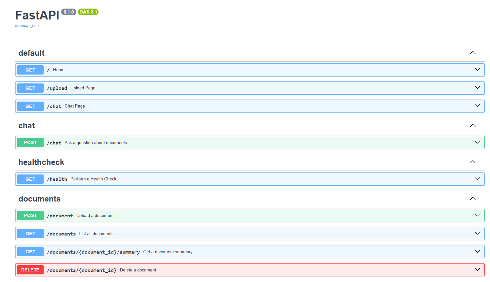

# Chat Bot - Document Processing System

A modern FastAPI-based document processing system with vector search capabilities, built with async SQLAlchemy, PostgreSQL, and OpenAI integration.

## Table of Contents

- [Features](#features)
- [Tech Stack](#tech-stack)
  - [Backend](#backend)
  - [Database](#database)
  - [Frontend](#frontend)
  - [DevOps](#devops)
- [Prerequisites](#prerequisites)
- [Installation & Setup](#installation--setup)
  - [1. Clone the Repository](#1-clone-the-repository)
  - [2. Environment Configuration](#2-environment-configuration)
  - [3. Using Docker (Recommended)](#3-using-docker-recommended)
  - [4. Development Setup](#4-development-setup)
- [Usage](#usage)
  - [Web Interface](#web-interface)
  - [Chat Interface](#chat-interface)
  - [API Usage](#api-usage)
- [API Documentation](#api-documentation)
  - [Interactive API Documentation](#interactive-api-documentation)
  - [Core Endpoints](#core-endpoints)
  - [Response Examples](#response-examples)
- [Testing](#testing)
  - [Comprehensive Test Coverage](#comprehensive-test-coverage)
  - [Coverage Metrics](#coverage-metrics)
  - [Testing Best Practices](#testing-best-practices)
- [Project Structure](#project-structure)
- [Document Processing Pipeline](#document-processing-pipeline)
  - [Processing Steps](#processing-steps)
- [RAG Pipeline](#rag-pipeline)
  - [RAG Architecture](#rag-architecture)
  - [Pipeline Stages](#pipeline-stages)
- [Deployment](#deployment)
  - [Docker Deployment](#docker-deployment)
- [Configuration](#configuration)
  - [Environment Variables](#environment-variables)
  - [Development Tools](#development-tools)
- [Monitoring & Health](#monitoring--health)
  - [Health Check Endpoint](#health-check-endpoint)
  - [Application Metrics](#application-metrics)
  - [Logging](#logging)
- [Known Limitations & Future Development](#known-limitations--future-development)
  - [Current Limitations](#current-limitations)
  - [Planned Improvements](#planned-improvements)
- [Contributing](#contributing)
  - [Development Workflow](#development-workflow)
  - [Code Style](#code-style)
  - [Testing Requirements](#testing-requirements)

## Features

- **Document Upload & Processing**: Support for PDF and TXT file uploads with intelligent parsing
- **AI-Powered Chat Interface**: Interactive chat with uploaded documents using RAG (Retrieval-Augmented Generation)
- **Vector Search**: Document embeddings using OpenAI's text-embedding-3-small model for semantic search
- **Intelligent Chunking**: Multiple chunking strategies (general and semantic) for optimal context retrieval
- **AI-Powered Summaries**: Automatic document summarization using OpenAI GPT models
- **Async Architecture**: Built with FastAPI and async SQLAlchemy for high performance
- **PostgreSQL + pgvector**: Vector database for semantic search capabilities
- **Modern Web Interface**: Clean, responsive HTML interface with Bootstrap styling
- **Content Moderation**: Built-in content filtering for safe AI interactions
- **RESTful API**: Comprehensive API with interactive documentation
- **Production Ready**: Docker containerization with health checks and monitoring
- **Comprehensive Testing**: 74+ tests covering all major functionality with 70%+ coverage

## Tech Stack

### Backend
- **FastAPI**: Modern async web framework with automatic API documentation
- **SQLAlchemy 2.0**: Async ORM with PostgreSQL integration
- **pgvector**: PostgreSQL extension for vector operations and similarity search
- **LangChain**: Document processing, text splitting, and RAG pipeline implementation
- **LangGraph**: Stateful graph framework for complex AI workflows
- **OpenAI**: GPT models for chat, embeddings (text-embedding-3-small), and summarization
- **Pydantic**: Data validation, settings management, and API schema definition

### Database
- **PostgreSQL**: Primary database with pgvector extension
- **Alembic**: Database migrations
- **AsyncPG**: Async PostgreSQL driver

### Frontend
- **Jinja2**: Server-side templating for dynamic HTML generation
- **Bootstrap 5**: Responsive UI components and modern styling
- **Bootstrap Icons**: Comprehensive icon library for enhanced UX
- **JavaScript (Vanilla)**: Interactive chat interface, file upload, and real-time features
- **CSS3**: Custom animations, responsive design, and modern UI effects

### DevOps
- **Docker & Docker Compose**: Multi-service containerization with health checks
- **Poetry**: Dependency management and virtual environment handling
- **Pre-commit**: Automated code quality hooks (Black, isort, Flake8)
- **Pytest**: Comprehensive async testing framework with 74+ tests
- **Alembic**: Database schema migrations and version control

## Prerequisites

- Python 3.11+
- Docker and Docker Compose
- Poetry (for development)
- OpenAI API key

## Installation & Setup

### 1. Clone the Repository
```bash
git clone <repository-url>
cd chat-bot
```

### 2. Environment Configuration
Create a `.env` file in the root directory:

```env
# Database Configuration
POSTGRES_USER=your_db_user
POSTGRES_PASSWORD=your_db_password
POSTGRES_DB=chat_bot_db
POSTGRES_HOST=db
POSTGRES_PORT=5432

# OpenAI Configuration
OPENAI_API_KEY=your_openai_api_key

# LangChain configuration for tracing
LANGCHAIN_API_KEY=your_langchain_api_key
LANGCHAIN_TRACING_V2=True
LANGCHAIN_PROJECT_NAME=chatbot_dev
```

### 3. Using Docker (Recommended)
```bash
# Start the application with Docker Compose
docker compose up --build
# Or using Make
make local_build
# The application will be available at http://localhost:8000
```

### 4. Development Setup
```bash
# Install dependencies
poetry install

# Install pre-commit hooks
poetry run pre-commit install

# Run database migrations
poetry run alembic upgrade head
```

## Usage

### Web Interface

The application provides an intuitive web interface for document management:

#### 1. Main Dashboard
Access the main dashboard at `http://localhost:8000/`


**Features:**
- View all uploaded documents
- Document metadata display (filename, size, type, upload date)
- Quick access to document actions
- Quick access to chat interface
- Responsive design for all screen sizes

#### 2. Document Upload
Navigate to the upload page at `http://localhost:8000/upload`


**Upload Process:**
1. **Select File**: Choose PDF or TXT files (max 10MB)
2. **Validation**: Real-time file type and size validation
3. **Processing**: Automatic content extraction and summarization
4. **Confirmation**: Success notification with document details

**Supported Formats:**
- **PDF Files**: `.pdf` (up to 10MB)
- **Text Files**: `.txt` (up to 10MB)

#### 3. Document Management
From the main dashboard, you can:

- **View Summary**: Get AI-generated document summaries


- **Delete**: Remove documents with confirmation


#### 4. AI Document Chat
Access the chat interface at `http://localhost:8000/chat`


### Chat Interface

The application features a sophisticated AI-powered chat interface that allows you to ask questions about your uploaded documents.

**Chat Features:**
- **Real-time Messaging**: Interactive chat interface with typing indicators
- **Smart Question Processing**: AI-powered question understanding and context analysis
- **Content Moderation**: Built-in filtering for appropriate interactions

#### RAG Pipeline Features
The chat system uses an advanced Retrieval-Augmented Generation (RAG) pipeline:

1. **Content Moderation**: Filters inappropriate questions before processing
2. **Semantic Search**: Finds relevant document chunks using vector similarity
3. **Relevance Checking**: Validates if retrieved content can answer the question
4. **Answer Generation**: Creates contextual responses using OpenAI's GPT models


### API Usage

#### Quick Start with cURL

**Upload a Document:**
```bash
curl -X POST "http://localhost:8000/document" \
  -H "Content-Type: multipart/form-data" \
  -F "file=@/path/to/your/document.pdf"
```

**List Documents:**
```bash
curl -X GET "http://localhost:8000/documents"
```

**Get Document Summary:**
```bash
curl -X GET "http://localhost:8000/documents/{document_id}/summary"
```

**Delete Document:**
```bash
curl -X DELETE "http://localhost:8000/documents/{document_id}"
```

**Ask Questions (Chat):**
```bash
curl -X POST "http://localhost:8000/chat" \
  -H "Content-Type: application/json" \
  -d '{"question": "What is this document about?"}'
```

## API Documentation

### Interactive API Documentation

Once the application is running, access the interactive API documentation:

- **Swagger UI**: `http://localhost:8000/docs`
- **ReDoc**: `http://localhost:8000/redoc`



### Core Endpoints

#### Document Management

| Method | Endpoint | Description | Parameters |
|--------|----------|-------------|------------|
| POST | `/document` | Upload a new document | `file` (multipart/form-data) |
| GET | `/documents` | List all documents | `skip`, `limit` (query parameters) |
| GET | `/documents/{id}/summary` | Get document summary | `id` (path parameter) |
| DELETE | `/documents/{id}` | Delete document | `id` (path parameter) |

#### Chat & AI

| Method | Endpoint | Description | Parameters |
|--------|----------|-------------|------------|
| GET | `/chat` | Chat interface page | None |
| POST | `/chat` | Ask question about documents | `question` (JSON body) |

#### Health Check

| Method | Endpoint | Description |
|--------|----------|-------------|
| GET | `/health` | Application health status |

### Response Examples

**Upload Success:**
```json
{
    "document_id": "123e4567-e89b-12d3-a456-426614174000",
    "filename": "example.pdf",
    "document_type": "pdf",
    "file_size": 1024576,
    "success": true
}
```

**Chat Response:**
```json
{
    "answer": "In object-oriented programming, a metaclass is a class whose instances are classes themselves"
}
```

**Document List:**
```json
{
    "success": true,
    "documents": [
        {
            "document_id": "123e4567-e89b-12d3-a456-426614174000",
            "filename": "example.pdf",
            "document_type": "pdf",
            "file_size": 1024576,
            "upload_timestamp": "2024-01-15T10:30:00Z",
            "summary": "This document discusses..."
        }
    ],
    "total": 1
}
```

**Error Response:**
```json
{
    "detail": "File size exceeds maximum limit of 10MB"
}
```

## Testing

### Comprehensive Test Coverage

The project includes **74+ tests** with comprehensive coverage across all core functionality:

```bash
# Run all tests
poetry run pytest
# Or using Make
make test

# Run with coverage report
poetry run pytest --cov=chat_bot --cov-report=html

# Run specific test categories
poetry run pytest -m unit           # Unit tests
poetry run pytest -m integration    # Integration tests

# Run specific test file
poetry run pytest tests/test_chat_service.py

# Run tests with verbose output
poetry run pytest -v
# Or using Make  
make test-verbose
```


### Coverage Metrics


### Testing Best Practices

**Quality Assurance:**
- All new features require corresponding tests
- Minimum 70% test coverage for new code
- Integration tests for API endpoints
- Unit tests for business logic
- Error scenario coverage

**Test Structure:**
```bash
tests/
├── conftest.py              # Shared fixtures and configuration
├── test_chat_service.py     # Chat and RAG functionality
├── test_document_*.py       # Document processing and management
├── test_integration.py      # End-to-end workflows
└── test_*.py               # Specific component tests
```

## Project Structure

```
chat-bot/
├── chat_bot/                      # Main application package
│   ├── config/                    # Configuration settings
│   │   └── settings.py            # Environment-based configuration
│   ├── core/                      # Core utilities and constants
│   │   ├── constants.py           # Application constants
│   │   └── enums.py               # Enumeration definitions
│   ├── document_processing/       # Document processing pipeline
│   │   ├── chunker/               # Text chunking strategies
│   │   │   └── document_chunker.py # Smart document chunking
│   │   └── parser/                # Document parsers (PDF, TXT)
│   │       ├── document_parser.py # Universal document parser
│   │       └── parsers/           # Specific format parsers
│   ├── models/                    # SQLAlchemy models
│   │   └── document.py            # Document database model
│   ├── schemas/                   # Pydantic schemas
│   │   ├── chat.py                # Chat request/response schemas
│   │   ├── common.py              # Common response schemas
│   │   ├── document.py            # Document-related schemas
│   │   └── health.py              # Health check schemas
│   ├── services/                  # Business logic layer
│   │   ├── chat_service.py        # Chat service with RAG integration
│   │   ├── document_service.py    # Document CRUD operations
│   │   ├── pg_document_service.py # Vector operations service
│   │   └── openai_service/        # OpenAI integration services
│   │       ├── rag_agent/         # RAG pipeline implementation
│   │       │   ├── nodes/         # LangGraph node implementations
│   │       │   ├── rag_agent.py   # Main RAG agent class
│   │       │   ├── state.py       # Graph state management
│   │       │   └── tools.py       # Retrieval tools
│   │       └── summarization.py   # Document summarization
│   ├── utils/                     # Utility functions
│   │   └── file_handler.py        # File validation and processing
│   ├── database.py                # Database connection and setup
│   ├── main.py                    # FastAPI application entry point
│   └── routes.py                  # API route definitions
├── tests/                         # Comprehensive test suite (74+ tests)
│   ├── conftest.py                # Pytest configuration and fixtures
│   ├── test_chat_service.py       # Chat service tests
│   ├── test_document_processing.py # Document processing tests
│   ├── test_document_service.py   # Service layer tests
│   ├── test_document_upload.py    # Document upload tests
│   ├── test_file_validation.py    # File validation tests
│   ├── test_health.py             # Health endpoint tests
│   ├── test_integration.py        # Integration workflow tests
│   ├── test_pg_document_service.py # Vector service tests
│   └── test_routes.py             # Route integration tests
├── templates/                     # HTML templates
│   ├── chat.html                  # Interactive chat interface
│   ├── home.html                  # Main dashboard
│   └── upload.html                # Upload interface
├── alembic/                       # Database migrations
├── readme-media/                  # Documentation screenshots
├── docker-compose.yaml            # Docker services configuration
├── Dockerfile                     # Application container
├── pyproject.toml                 # Project dependencies and configuration
└── README.md                      # This file
```

## Document Processing Pipeline

The application follows a sophisticated document processing workflow:

### Processing Steps

1. **File Upload Validation**
   - File type checking (PDF/TXT only)
   - Size validation (max 10MB)
   - Content type verification

2. **Content Extraction**
   - **PDF Processing**: Extract text using specialized PDF parsers
   - **Text Processing**: Direct content reading for TXT files
   - **Metadata Extraction**: File properties and document information

3. **Text Chunking**
   - **Configurable Strategy**: Adjustable chunk sizes and overlap
   - **Smart Splitting**: Preserves sentence and paragraph boundaries
   - **Optimization**: Balances processing efficiency and context preservation

4. **AI Processing**
   - **Embedding Generation**: OpenAI-powered vector representations
   - **Summary Creation**: Intelligent document summarization
   - **Quality Assurance**: Content validation and error handling

5. **Database Storage**
   - **Dual Storage**: PostgreSQL for metadata, PgVector for embeddings
   - **Synchronized Operations**: Consistent data across storage systems
   - **Transaction Safety**: Rollback capabilities for failed operations

## RAG Pipeline

The application implements a sophisticated **Retrieval-Augmented Generation (RAG)** pipeline using LangGraph for stateful workflow management. This ensures high-quality, contextual responses to user questions.

### RAG Architecture

The RAG system processes questions through multiple stages to ensure accuracy and safety:


### Pipeline Stages

#### 1. Content Moderation
- **Purpose**: Filter inappropriate or harmful questions
- **Implementation**: OpenAI moderation API integration
- **Action**: Blocks unsafe content before processing
- **Fallback**: Provides appropriate safety message to users

#### 2. Document Retrieval
- **Strategy**: Semantic search using vector embeddings
- **Model**: OpenAI text-embedding-3-small for query encoding
- **Storage**: PostgreSQL with pgvector extension
- **Configuration**: Retrieval of top-k most relevant chunks (configurable)

#### 3. Relevance Assessment
- **Purpose**: Evaluate if retrieved documents can answer the question
- **Method**: AI-powered relevance scoring
- **Threshold**: Configurable relevance score for quality control
- **Handling**: Graceful responses when content is insufficient

#### 4. Answer Generation
- **Model**: OpenAI GPT models for natural language generation
- **Context**: Uses only relevant, retrieved document chunks
- **Constraints**: Answers strictly based on provided documents
- **Output**: Structured response with source attribution


## Deployment

### Docker Deployment

The application is fully containerized for easy deployment with chat and RAG capabilities.

#### Prerequisites
- Docker and Docker Compose installed
- OpenAI API key for chat functionality
- Sufficient resources for vector operations

#### Quick Start
```bash
# Create environment file
cp .env.example .env
# Edit .env with OpenAI API key and other settings

# Start all services
docker-compose up -d --build

# Run database migrations
docker-compose exec app alembic upgrade head

# View logs
docker-compose logs -f app

# Stop services
docker-compose down
```

#### Service Architecture

**Application Service (`app`)**
- **Port**: 8000 (mapped to host)
- **Health Check**: HTTP endpoint monitoring
- **Auto-restart**: Unless manually stopped
- **Volume**: Code hot-reloading in development
- **Dependencies**: Database service startup

**Database Service (`db`)**
- **Image**: `ankane/pgvector` (PostgreSQL with vector extension)
- **Port**: 5432 (internal network)
- **Health Check**: PostgreSQL readiness probe
- **Persistent Storage**: Named volume for data persistence
- **Extensions**: PgVector for embedding storage

#### Production Considerations
- Set `DEBUG=false` in production
- Use strong database passwords
- Configure SSL/TLS certificates
- Set up monitoring and logging
- Regular database backups

## Configuration

### Environment Variables

| Variable | Description | Default |
|----------|-------------|---------|
| `POSTGRES_USER` | Database username | `chat_user` |
| `POSTGRES_PASSWORD` | Database password | - |
| `POSTGRES_DB` | Database name | `chat_bot_db` |
| `POSTGRES_HOST` | Database host | `db` |
| `POSTGRES_PORT` | Database port | `5432` |
| `OPENAI_API_KEY` | OpenAI API authentication | - |
| `LANGCHAIN_API_KEY` | LangChain API authentication | - |
| `LANGCHAIN_TRACING_V2` | Enabling LangSmith tracing | True |
| `LANGCHAIN_PROJECT_NAME` | Project name for tracing | `chatbot_dev` |


### Development Tools

```bash
# Code formatting
poetry run black .
poetry run isort .

# Linting
poetry run flake8 .

# Pre-commit hooks
poetry run pre-commit run --all-files

# Database migrations
poetry run alembic revision --autogenerate -m "Description"
poetry run alembic upgrade head
```

## Monitoring & Health

### Health Check Endpoint

Monitor application status with the built-in health check:

```bash
curl http://localhost:8000/health
```

**Response:**
```json
{
    "status": "OK"
}
```

### Application Metrics

The application provides insights into:
- Document processing success rates
- Upload volume and file types
- Database connection status
- OpenAI API response times
- Error rate monitoring

### Logging

Comprehensive logging for debugging and monitoring:

```bash
# View application logs
docker-compose logs -f app

# Filter error logs
docker-compose logs app | grep ERROR

# Database logs
docker-compose logs db
```

## Known Limitations & Future Development

### Current Limitations

#### **Security & Authentication**
- **No User Management**: Single-tenant system without user accounts or authentication
- **Open API Access**: All endpoints are publicly accessible without authorization
- **Session Management**: No persistent user sessions or state management
- **CORS Policy**: Permissive CORS settings suitable only for development

#### **Chat System Limitations**
- **No Chat History**: Messages are not permanently stored between sessions
- **No Thread Management**: Each question is independent without conversation context
- **Limited Memory**: No conversation continuity or follow-up question handling
- **Single Session**: No support for multiple concurrent conversations

#### **Data Management Issues**
- **Duplicate Documents**: No detection or prevention of duplicate file uploads
- **Transaction Consistency**: Separate database operations without distributed transactions
- **Data Integrity**: Potential inconsistency between PostgreSQL and vector store
- **Cleanup Limitations**: Manual intervention needed for orphaned data

#### **Monitoring & Evaluation**
- **No User Feedback**: Missing feedback collection for chat responses
- **Limited Analytics**: Basic logging without comprehensive performance metrics
- **No A/B Testing**: No experimentation framework for RAG improvements
- **Missing Evaluation**: No automated quality assessment of generated responses

### Planned Improvements

#### **Phase 1: Security & User Management**
1. **User Authentication & Authorization**
   - Implement JWT-based authentication system
   - Add user registration and login functionality
   - Role-based access control (RBAC) for different user types
   - Password reset and email verification flows

2. **API Security Enhancements**
   - Rate limiting implementation using Redis or in-memory stores
   - API key management for programmatic access
   - CORS policy refinement for production environments
   - Input validation and sanitization improvements

3. **Session Management**
   - Secure session handling with HTTP-only cookies
   - Session timeout and refresh token mechanisms
   - Multi-device session management

#### **Phase 2: Enhanced Chat System**
1. **Persistent Chat History**
   ```python
   # Implementation using PostgresChatMessageHistory
   from langchain_postgres import PostgresChatMessageHistory
   
   # Store messages with thread IDs for conversation continuity
   chat_history = PostgresChatMessageHistory(
       connection_string=DATABASE_URL,
       session_id=user_session_id,
       table_name="chat_messages"
   )
   ```

2. **OpenAI Thread Integration**
   - Integrate with OpenAI Assistants API for native thread management
   - Support for conversation context and follow-up questions
   - Chat history export and import functionality
   - Ability to reset conversation threads

3. **Enhanced Chat Features**
   - Message reactions and feedback collection
   - Chat export functionality (PDF, TXT, JSON)
   - Search within chat history
   - Conversation summarization

#### **Phase 3: Data Integrity & Performance**
1. **Document Duplicate Detection**
   ```python
   # Hash-based duplicate detection
   import hashlib
   
   def detect_duplicate(content: str, filename: str) -> bool:
       content_hash = hashlib.sha256(content.encode()).hexdigest()
       # Check against existing document hashes
       return await check_duplicate_hash(content_hash)
   ```

2. **Distributed Transactions**
   ```python
   # Implement two-phase commit for PostgreSQL + Vector store
   async def atomic_document_operation():
       async with database_transaction():
           async with vector_store_transaction():
               # Coordinated operations across both stores
               pass
   ```

3. **Advanced Document Processing**
   - Support for additional file formats (DOCX, PPTX, HTML)
   - Document versioning and change tracking
   - Batch document processing capabilities
   - Document relationship mapping

#### **Phase 4: Monitoring & Evaluation**
1. **LangSmith Integration**
   ```python
   # Online evaluation with LangSmith
   from langsmith.client import Client
   
   client = Client()
   
   # Track RAG performance metrics
   def evaluate_rag_response(response: dict, run_id: str) -> str:
      for evaluator in online_rag_evaluators:
         with tracing_v2_enabled(project_name="evaluators"):
               grade = evaluator(response)

         langsmith_client.create_feedback(
               run_id,
               key="RAG_" + evaluator.__name__,
               score=grade.get("score"),
               comment=grade.get("explanation"),
         )
   ```

2. **User Feedback System**
   - Thumbs up/down rating for chat responses
   - Detailed feedback forms for quality improvement
   - Feedback analytics dashboard
   - Response improvement based on user input

3. **Golden Dataset Evaluation**
   ```python
   # Offline evaluation using curated datasets
   async def run_offline_evaluation():
      evaluation_results = langsmith_client.evaluate(
      target,
      data=EVALUATION_DATASET_NAME,
      evaluators=[
         evaluate_correctness,
         evaluate_groundedness,
         evaluate_retrieval_relevance,
        ],
      experiment_prefix=EVALUATION_PREFIX,
      )

      return evaluation_results

   ```

## Contributing

### Development Workflow

1. **Fork & Clone**: Create your own copy of the repository
2. **Environment Setup**: Follow installation instructions
3. **Feature Branch**: Create branch for your changes
4. **Development**: Make changes with tests
5. **Quality Checks**: Run linting and formatting
6. **Testing**: Ensure all tests pass
7. **Pull Request**: Submit for review

### Code Style

- **Black**: Code formatting
- **isort**: Import sorting  
- **Flake8**: Linting and style checking
- **Type Hints**: Full type annotation coverage
- **Docstrings**: Google-style documentation

### Testing Requirements

- Minimum 70% test coverage
- All new features must include tests
- Integration tests for API endpoints
- Unit tests for business logic

---

**Built with ❤️ using FastAPI, PostgreSQL, and OpenAI**