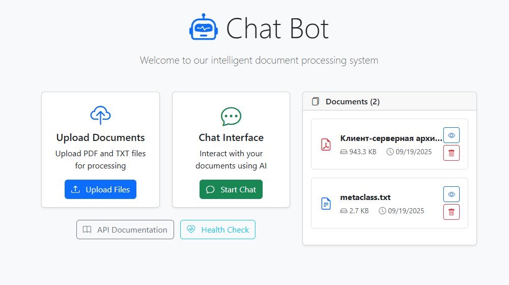
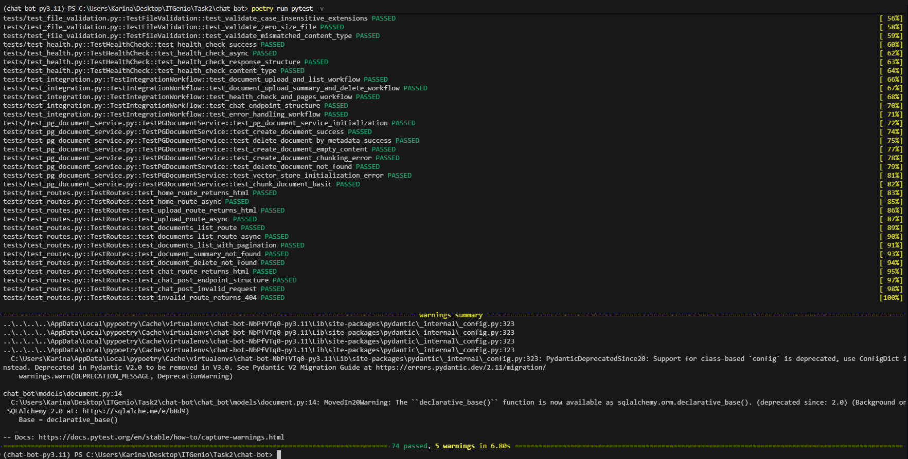

# Chat Bot - Document Processing System

A modern FastAPI-based document processing system with vector search capabilities, built with async SQLAlchemy, PostgreSQL, and OpenAI integration.

## Table of Contents

- [Features](#features)
- [Tech Stack](#tech-stack)
- [Prerequisites](#prerequisites)
- [Installation & Setup](#installation--setup)
- [Usage](#usage)
  - [Web Interface](#web-interface)
  - [API Usage](#api-usage)
- [API Documentation](#api-documentation)
- [Testing](#testing)
- [Project Structure](#project-structure)
- [Document Processing Pipeline](#document-processing-pipeline)
- [Deployment](#deployment)
- [Configuration](#configuration)
- [Monitoring & Health](#monitoring--health)
- [Contributing](#contributing)

## Features

- **Document Upload & Processing**: Support for PDF and TXT file uploads with intelligent parsing
- **Vector Search**: Document embeddings using OpenAI's text-embedding-3-small model
- **Intelligent Chunking**: Multiple chunking strategies (general and semantic)
- **AI-Powered Summaries**: Automatic document summarization using OpenAI GPT models
- **Async Architecture**: Built with FastAPI and async SQLAlchemy for high performance
- **PostgreSQL + pgvector**: Vector database for semantic search capabilities
- **Web Interface**: Clean HTML interface for document management
- **RESTful API**: Comprehensive API with documentation
- **Production Ready**: Docker containerization with health checks and monitoring

## Tech Stack

### Backend
- **FastAPI**: Modern async web framework
- **SQLAlchemy 2.0**: Async ORM with PostgreSQL
- **pgvector**: PostgreSQL extension for vector operations
- **LangChain**: Document processing and text splitting
- **OpenAI**: Embeddings and text generation
- **Pydantic**: Data validation and settings management

### Database
- **PostgreSQL**: Primary database with pgvector extension
- **Alembic**: Database migrations
- **AsyncPG**: Async PostgreSQL driver

### Frontend
- **Jinja2**: Server-side templating
- **Bootstrap**: Responsive UI components
- **JavaScript**: Interactive file upload and management

### DevOps
- **Docker & Docker Compose**: Containerization
- **Poetry**: Dependency management
- **Pre-commit**: Code quality hooks
- **Pytest**: Async testing framework

## Prerequisites

- Python 3.11+
- Docker and Docker Compose
- Poetry (for development)
- OpenAI API key

## Installation & Setup

### 1. Clone the Repository
```bash
git clone <repository-url>
cd chat-bot
```

### 2. Environment Configuration
Create a `.env` file in the root directory:

```env
# Database Configuration
POSTGRES_USER=your_db_user
POSTGRES_PASSWORD=your_db_password
POSTGRES_DB=chat_bot_db
POSTGRES_HOST=db
POSTGRES_PORT=5432

# OpenAI Configuration
OPENAI_API_KEY=your_openai_api_key
```

### 3. Using Docker (Recommended)
```bash
# Start the application with Docker Compose
docker compose up --build
# Or using Make
make local_build
# The application will be available at http://localhost:8000
```

### 4. Development Setup
```bash
# Install dependencies
poetry install

# Install pre-commit hooks
poetry run pre-commit install

# Run database migrations
poetry run alembic upgrade head
```

## Usage

### Web Interface

The application provides an intuitive web interface for document management:

#### 1. Main Dashboard
Access the main dashboard at `http://localhost:8000/`



**Features:**
- View all uploaded documents
- Document metadata display (filename, size, type, upload date)
- Quick access to document actions
- Responsive design for all screen sizes

#### 2. Document Upload
Navigate to the upload page at `http://localhost:8000/upload`


**Upload Process:**
1. **Select File**: Choose PDF or TXT files (max 10MB)
2. **Validation**: Real-time file type and size validation
3. **Processing**: Automatic content extraction and summarization
4. **Confirmation**: Success notification with document details

**Supported Formats:**
- **PDF Files**: `.pdf` (up to 10MB)
- **Text Files**: `.txt` (up to 10MB)

#### 3. Document Management
From the main dashboard, you can:

- **View Summary**: Get AI-generated document summaries


- **Delete**: Remove documents with confirmation


### API Usage

#### Quick Start with cURL

**Upload a Document:**
```bash
curl -X POST "http://localhost:8000/document" \
  -H "Content-Type: multipart/form-data" \
  -F "file=@/path/to/your/document.pdf"
```

**List Documents:**
```bash
curl -X GET "http://localhost:8000/documents"
```

**Get Document Summary:**
```bash
curl -X GET "http://localhost:8000/documents/{document_id}/summary"
```

**Delete Document:**
```bash
curl -X DELETE "http://localhost:8000/documents/{document_id}"
```

## API Documentation

### Interactive API Documentation

Once the application is running, access the interactive API documentation:

- **Swagger UI**: `http://localhost:8000/docs`
- **ReDoc**: `http://localhost:8000/redoc`


### Core Endpoints

#### Document Management

| Method | Endpoint | Description | Parameters |
|--------|----------|-------------|------------|
| POST | `/document` | Upload a new document | `file` (multipart/form-data) |
| GET | `/documents` | List all documents | None |
| GET | `/documents/{id}` | Get document details | `id` (path parameter) |
| GET | `/documents/{id}/summary` | Get document summary | `id` (path parameter) |
| DELETE | `/documents/{id}` | Delete document | `id` (path parameter) |

#### Health Check

| Method | Endpoint | Description |
|--------|----------|-------------|
| GET | `/health` | Application health status |

### Response Examples

**Upload Success:**
```json
{
    "document_id": "123e4567-e89b-12d3-a456-426614174000",
    "filename": "example.pdf",
    "content_type": "application/pdf",
    "size": 1024576,
    "created_at": "2024-01-15T10:30:00Z",
    "summary": "This document discusses..."
}
```

**Error Response:**
```json
{
    "detail": "File size exceeds maximum limit of 10MB"
}
```

## Testing

### Running Tests

The project includes comprehensive test coverage for all core functionality:

```bash
# Run all tests
poetry run pytest
#Or using Make
make test

# Run specific test file
poetry run pytest tests/test_document_service.py

# Run tests with verbose output
poetry run pytest -v
#Or using Make
make test-verbose
```



### Test Configuration

Tests use SQLite for isolation and include:
- Async database fixtures
- Mocked external services (OpenAI)
- Temporary file handling
- Comprehensive error scenario coverage

## Project Structure

```
chat-bot/
├── chat_bot/                      # Main application package
│   ├── config/                    # Configuration settings
│   │   └── settings.py            # Environment-based configuration
│   ├── core/                      # Core utilities and constants
│   │   └── constants.py           # Application constants
│   ├── document_processing/       # Document processing pipeline
│   │   ├── chunker/               # Text chunking strategies
│   │   └── parser/                # Document parsers (PDF, TXT)
│   ├── models/                    # SQLAlchemy models
│   │   └── document.py            # Document database model
│   ├── schemas/                   # Pydantic schemas
│   │   ├── common.py              # Common response schemas
│   │   ├── document.py            # Document-related schemas
│   │   └── health.py              # Health check schemas
│   ├── services/                  # Business logic layer
│   │   ├── document_service.py    # Document CRUD operations
│   │   ├── pg_document_service.py # Vector operations service
│   │   └── openai_service.py      # OpenAI integration
│   ├── utils/                     # Utility functions
│   │   └── file_handler.py        # File validation and processing
│   ├── database.py                # Database connection and setup
│   ├── main.py                    # FastAPI application entry point
│   └── routes.py                  # API route definitions
├── tests/                         # Test suite
│   ├── conftest.py                # Pytest configuration and fixtures
│   ├── test_health.py             # Health endpoint tests
│   ├── test_document_service.py   # Service layer tests
│   ├── test_document_upload.py    # Document upload tests
│   └── test_routes.py             # Route integration tests
├── templates/                     # HTML templates
│   ├── home.html                  # Main dashboard
│   └── upload.html                # Upload interface
├── alembic/                       # Database migrations
├── docker-compose.yaml            # Docker services configuration
├── Dockerfile                     # Application container
├── pyproject.toml                 # Project dependencies and configuration
└── README.md                      # This file
```

## Document Processing Pipeline

The application follows a sophisticated document processing workflow:

### Processing Steps

1. **File Upload Validation**
   - File type checking (PDF/TXT only)
   - Size validation (max 10MB)
   - Content type verification

2. **Content Extraction**
   - **PDF Processing**: Extract text using specialized PDF parsers
   - **Text Processing**: Direct content reading for TXT files
   - **Metadata Extraction**: File properties and document information

3. **Text Chunking**
   - **Configurable Strategy**: Adjustable chunk sizes and overlap
   - **Smart Splitting**: Preserves sentence and paragraph boundaries
   - **Optimization**: Balances processing efficiency and context preservation

4. **AI Processing**
   - **Embedding Generation**: OpenAI-powered vector representations
   - **Summary Creation**: Intelligent document summarization
   - **Quality Assurance**: Content validation and error handling

5. **Database Storage**
   - **Dual Storage**: PostgreSQL for metadata, PgVector for embeddings
   - **Synchronized Operations**: Consistent data across storage systems
   - **Transaction Safety**: Rollback capabilities for failed operations

## Deployment

### Docker Deployment

The application is fully containerized for easy deployment

#### Quick Start
```bash
# Start all services
docker-compose up -d

# View logs
docker-compose logs -f app

# Stop services
docker-compose down
```

#### Service Architecture

**Application Service (`app`)**
- **Port**: 8000 (mapped to host)
- **Health Check**: HTTP endpoint monitoring
- **Auto-restart**: Unless manually stopped
- **Volume**: Code hot-reloading in development
- **Dependencies**: Database service startup

**Database Service (`db`)**
- **Image**: `ankane/pgvector` (PostgreSQL with vector extension)
- **Port**: 5432 (internal network)
- **Health Check**: PostgreSQL readiness probe
- **Persistent Storage**: Named volume for data persistence
- **Extensions**: PgVector for embedding storage

#### Production Considerations
- Set `DEBUG=false` in production
- Use strong database passwords
- Configure SSL/TLS certificates
- Set up monitoring and logging
- Regular database backups

## Configuration

### Environment Variables

| Variable | Description | Default |
|----------|-------------|---------|
| `POSTGRES_USER` | Database username | `chat_user` |
| `POSTGRES_PASSWORD` | Database password | - |
| `POSTGRES_DB` | Database name | `chat_bot_db` |
| `POSTGRES_HOST` | Database host | `db` |
| `POSTGRES_PORT` | Database port | `5432` |
| `OPENAI_API_KEY` | OpenAI API authentication | - |


### Application Settings

The application automatically configures based on the environment:

```python
# Development settings
DEBUG = True
LOG_LEVEL = "DEBUG"
RELOAD = True

# Production settings  
DEBUG = False
LOG_LEVEL = "INFO"
RELOAD = False
```

### Development Tools

```bash
# Code formatting
poetry run black .
poetry run isort .

# Linting
poetry run flake8 .

# Pre-commit hooks
poetry run pre-commit run --all-files

# Database migrations
poetry run alembic revision --autogenerate -m "Description"
poetry run alembic upgrade head
```

## Monitoring & Health

### Health Check Endpoint

Monitor application status with the built-in health check:

```bash
curl http://localhost:8000/health
```

**Response:**
```json
{
    "status": "OK"
}
```

### Application Metrics

The application provides insights into:
- Document processing success rates
- Upload volume and file types
- Database connection status
- OpenAI API response times
- Error rate monitoring

### Logging

Comprehensive logging for debugging and monitoring:

```bash
# View application logs
docker-compose logs -f app

# Filter error logs
docker-compose logs app | grep ERROR

# Database logs
docker-compose logs db
```

## Contributing

### Development Workflow

1. **Fork & Clone**: Create your own copy of the repository
2. **Environment Setup**: Follow installation instructions
3. **Feature Branch**: Create branch for your changes
4. **Development**: Make changes with tests
5. **Quality Checks**: Run linting and formatting
6. **Testing**: Ensure all tests pass
7. **Pull Request**: Submit for review

### Code Style

- **Black**: Code formatting
- **isort**: Import sorting  
- **Flake8**: Linting and style checking
- **Type Hints**: Full type annotation coverage
- **Docstrings**: Google-style documentation

### Testing Requirements

- Minimum 80% test coverage
- All new features must include tests
- Integration tests for API endpoints
- Unit tests for business logic

---

**Built with ❤️ using FastAPI, PostgreSQL, and OpenAI**